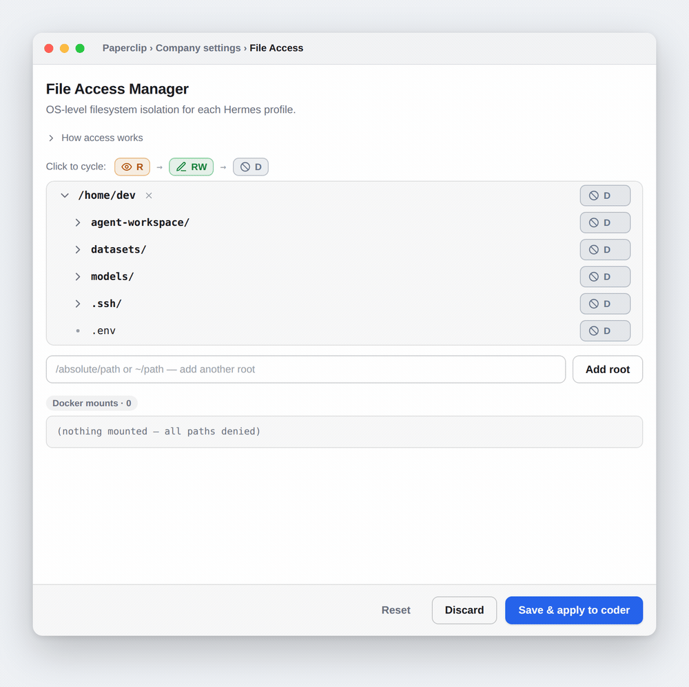
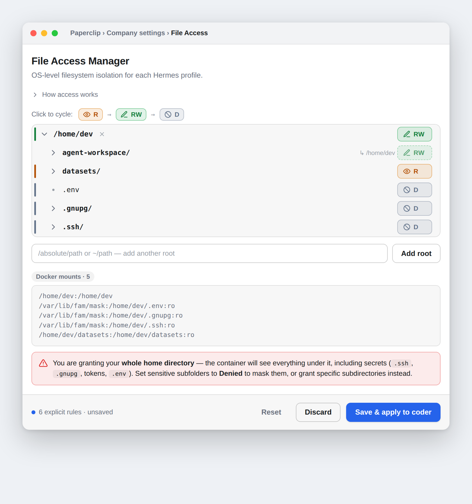

# File Access Manager


**Kernel-enforced filesystem sandboxing for your AI agents.** A
[Paperclip](https://paperclip.ing) plugin that lets you decide — per
[Hermes](https://hermes-agent.nousresearch.com) profile, per path — exactly what
an agent can read, write, or even see. Mark host paths **Read/Write**, **Read
Only**, or **Denied** in a tree UI; the plugin turns your choices into Docker
bind mounts and switches the profile to Hermes' Docker terminal backend, so the
**kernel** enforces the boundary — not an application-level path check the
agent's shell can walk around.

- **Secure by default** — every path is Denied until you grant it. A denied path
  simply doesn't exist inside the container.
- **Real enforcement** — Hermes' built-in path controls only guard the file
  tools; the agent's shell bypasses them entirely. A `:ro` bind mount cannot be
  written by any process, even the file's owner.
- **One-click apply** — saving writes the profile config, recreates the sandbox
  container, and restarts the gateway. No manual steps, live progress in the UI.
- **Profile-aware** — discovers your Hermes profiles automatically and writes
  only to the ones you select; the router profile is never touched by accident.
- **Battle-tested** — a real-Docker integration suite proves every permission
  mode on Linux and macOS in CI.

## See it work

Mark paths in the tree, watch the generated Docker mounts update live, then
**Save & apply** — the plugin writes the profile config, recreates the sandbox
container, and restarts the gateway, reporting each step.



## Install

Prerequisites:

- **Bun** — to build the plugin.
- **`paperclipai` CLI** on the Paperclip host (local installs expose it at
  `~/.paperclip/node_modules/.bin/paperclipai` if it's not on `PATH`).
- **`PAPERCLIP_API_KEY`** — a board API key with `instance_admin` role, already
  exported in your shell. The CLI reads it from the environment only — never
  pass it on a command line or paste it into a file.
- **Docker or Podman** — needed for enforcement at runtime, not for install.

```bash
git clone https://github.com/marospekarik/file-access-manager.git
cd file-access-manager
bun install && bun run build
paperclipai plugin install --local "$PWD"
```

Verify:

```bash
paperclipai plugin inspect ordillect.file-access-manager   # status should be "ready"
```

If status is `error`, tail `~/.paperclip/instances/default/logs/server.log`; the
usual cause is a stale `dist/` — rerun `bun run build`, then
`paperclipai plugin enable ordillect.file-access-manager`. Remove with
`paperclipai plugin uninstall ordillect.file-access-manager`.

No CLI available? `./install-plugin.sh` wraps the REST API instead
(`PAPERCLIP_API_BASE` defaults to `http://localhost:3000/api`).

## Use


- **Company settings → File Access** — select one or more profiles (the
  router/default is clearly flagged), browse the host filesystem tree, assign
  permissions, preview the generated mounts, save.
- **Agent detail → File Access tab** — edits only the profile that agent runs on.

| Selection        | Effect in the container                         |
|------------------|-------------------------------------------------|
| Read/Write       | Full access; changes land on the host           |
| Read Only        | Readable; writes fail (`Read-only file system`) |
| Denied (default) | Path does not exist in the container            |

Folder settings inherit downward; deeper settings override — parent `rw`, child
`ro`, grandchild `denied` all hold at once. Broad grants (e.g. your whole home
directory) are allowed but flagged: set `.ssh`, `.gnupg`, `.env` folders to
Denied to mask them.



Once a profile runs the Docker backend, `terminal`, `read_file`, `write_file`,
and `execute_code` all operate inside the sandbox and see only granted paths. A
profile with nothing granted has no host access — that's the isolation working,
and the UI warns before you save one.

## Develop

```bash
bun install
bun run build              # dist/worker.js, dist/manifest.js, dist/ui/index.js
bun run typecheck
bun run test               # unit: permission model, config writers, profile targeting
bun run test:integration   # real Docker containers verify every permission mode (needs Docker)
```

Built on [`@paperclipai/plugin-sdk`](https://www.npmjs.com/package/@paperclipai/plugin-sdk).
The pure permission model lives in `src/model.ts`; its `generateDockerVolumes()`
is the single translation point used by the UI preview, the worker, and the
integration tests. `src/worker.ts` is the plugin bridge, `src/apply.ts` handles
the post-save container recreate + gateway restart (disable with
`FAM_SKIP_RUNTIME_APPLY=1` for config-only writes — tests set this). Saving
writes both `<profile>/.env` and `<profile>/config.yaml` atomically, mirroring
`hermes config set terminal.*`.

Portability notes: non-standard Hermes root via `FAM_HERMES_ROOT`; Podman via
the profile's `HERMES_DOCKER_BINARY`; Windows via WSL2 only; gateway restart
recognizes systemd `--user` units and reports `skipped` elsewhere. Found a
mount bug? Add a case to `tests/integration/regression.test.ts`. Deeper design
analysis: [`Plans/docker-backend-investigation.md`](./Plans/docker-backend-investigation.md).

## License

MIT
